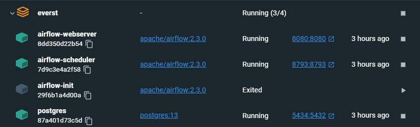
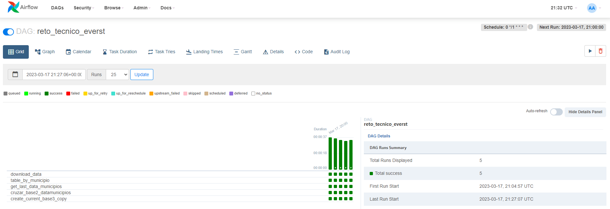
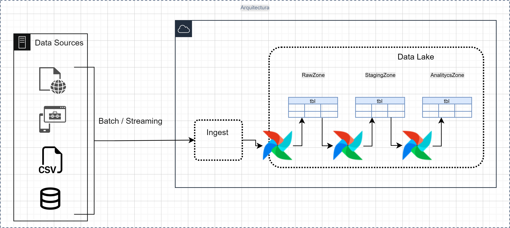

<h1 align="center">
  <br>
  Reto Técnico EVERST
  <br>
</h1>

## Preparar el entorno

* Para crear la infraestructura se utilizó docker, levantando la arquitectura necesaria para ejecutar **airflow** usando el [docker-compose.yml](docker-compose.yml) y el comando `docker-compose -f docker-compose.yml up -d`, creando así los contenedores necesarios.


## Ejecución del DAG


Se creó el DAG [reto_tecnico_everst](dags/reto_tecnico_everst.py) para que ejecute cada hora `schedule_interval='0 */1 * * *'`, solo 1 dag_run por vez `max_active_runs=1` y que no se autocompleten los dag_run faltantes `catchup=False`, además de que se agregaron cuatro tareas:
  * #### **download_data**: 
  Este task es el encargado de conectarse con la API, y descargar la base, además de guardarla en Raw Zone en su formato original, JSON, para su uso en los siguientes tasks.
  ```python
    def download_data(url, **kwargs):
      """Función para descargar el contenido del API y guardarlo en RAW"""
      task_instance = kwargs['ti']
      try:
          request_site = Request(url, headers={"User-Agent": "Mozilla/5.0"})
          gz_content = urlopen(request_site).read()
      except Exception as e:
          logging.error(f'Se genero un Error al intentar conectar con la url: {url}')
          raise AirflowFailException(e)
      logging.info('Generando descarga del GZ')
      json_content = gzip.decompress(gz_content)
      data = json.loads(json_content)
      now = datetime.now()
      dt_string = now.strftime("%Y%m%d_%H.%M")
      json_path = f'dags/data/Raw/base_api/base_{dt_string}.json'
      task_instance.xcom_push(key="json_path", value=json_path)
      logging.info(f'Guardando la base generada desde el API, path: {json_path}')
      with open(json_path, 'w') as file:
          json.dump(data,file)
  ```
  * #### **table_by_municipio**: 
  Este task es el encargado de generar una tabla a nivel municipio en la que cada registro contenga el promedio de temperatura y precipitación de las últimas dos horas y almacenar el resultado en Staging Zone en formato parquet para optimizar el peso y el procesamiento.
  ```python
    def table_by_municipio(task_xcom, **kwargs):
      """Función para crear la tabla por municipio"""
      task_instance = kwargs['ti']
      json_path = task_instance.xcom_pull(task_ids=task_xcom, key="json_path")
      logging.info('Leyendo la base extraida del API')
      with open(json_path, 'r') as file:
          data = json.loads(file.read())
      df = pd.DataFrame(data)
      date_lst = list(df['hloc'].unique())
      date_lst.sort(reverse=True)
      n_df = df[df['hloc'] >= date_lst[1]]
      logging.info('Formateando los tipos de datos en el DataFrame.')
      n_df['temp'] = pd.to_numeric(n_df["temp"])
      n_df['prec'] = pd.to_numeric(n_df["prec"])
      n_df['ides'] = n_df['ides'].astype(np.int64)
      n_df['idmun'] = n_df['idmun'].astype(np.int64)
      logging.info('Creando el promedio de temperatura y precipitación de las últimas dos horas.')
      n_df = n_df.groupby(['ides', 'idmun', 'nes', 'nmun'])['prec', 'temp'].agg('mean').reset_index()
      now = datetime.now()
      dt_string = now.strftime("%Y%m%d_%H.%M")
      parquet_path = f'dags/data/Staging/base_2/base_{dt_string}.parquet'
      task_instance.xcom_push(key="parquet_path_tbl_by_mun", value=parquet_path)
      logging.info(f'Guardando la base tabla por municipio en formato parquet, path: {parquet_path}')
      # Saving as parquet
      n_df.to_parquet(parquet_path)
  ```
  * #### **get_last_data_municipios**: 
  Este task es el encargado de generar el path del archivo con la ultima fecha de la carpeta **“data_municipios”**.
  ```python
    def get_last_data_municipios(**kwargs):
      """Función para crear la tabla data_municipio"""
      folder = 'dags/data/Raw/data_municipios'
      task_instance = kwargs['ti']
      max_dt_mun = max(os.listdir(folder))
      file = os.listdir(f'{folder}/{max_dt_mun}/')[0]
      path_max_dt_mun = f'{folder}/{max_dt_mun}/{file}'
      task_instance.xcom_push(key="path_max_dt_mun", value=path_max_dt_mun)
      logging.info(f'Generando el path del archivo mas reciente de data_municipios: {path_max_dt_mun}')

  ```
  * #### **cruzar_base2_datamunicipios**: 
  Este task es el encargado de cruzar las tablas generadas por los tasks **table_by_municipio** y **create_data_municipios**, semejante a realizar un Left Join en SQL, basado en la columna **nmun** y almacenar el resultado en Analytics Zone en una carpeta histórica en formato parquet.
  ```python
    def cruzar_base2_datamunicipios(task_base_2, taskmun, **kwargs):
      """Función para cruzar los datos generaos por base_2 y data_municipios"""
      task_instance = kwargs['ti']
      base_2_path = task_instance.xcom_pull(task_ids=task_base_2, key="parquet_path_tbl_by_mun")
      dt_mun_path = task_instance.xcom_pull(task_ids=taskmun, key="path_max_dt_mun")
      df_base_2 = pd.read_parquet(base_2_path, engine='pyarrow')
      df_dt_mun = pd.read_csv(dt_mun_path, sep=',')
      df_dt_mun.columns = ['ides', 'idmun', 'value']
      df_base_3 = pd.merge(left=df_base_2, right=df_dt_mun, how='left', on=['ides', 'idmun'])
      now = datetime.now()
      dt_string = now.strftime("%Y%m%d_%H.%M")
      parquet_path = f'dags/data/Analytics/base_3/History/base_3_{dt_string}.parquet'
      task_instance.xcom_push(key="parquet_base3", value=parquet_path)
      logging.info(f'Guardando la base del cruce de data_municipios y base_02 en formato parquet, path: {parquet_path}')
      # Saving as parquet
      df_base_3.to_parquet(parquet_path)
  ```
  * #### **create_current_base3_copy**: 
  Este task es el encargado de realizar una copia del último archivo generado por el task **cruzar_base2_datamunicipios** y colocarla en Analytics Zone con el texto **current** en el nombre.
  ```bash
    $ cp /opt/airflow/{{ task_instance.xcom_pull(task_ids='cruzar_base2_datamunicipios', key='parquet_base3') }} /opt/airflow/dags/data/Analytics/base_3/base_3_current.parquet
  ```

> **Nota**
> Para pasar información entre los tasks, se han utilizado XCOMs, y la url se está manejando como una variable de Airflow.

## Preguntas adicionales

* ### Qué mejoras propondrías a tu solución para siguientes versiones?
    Remplazar los PythonOperator por SparkSubmitOperator, para trabajar con PySpark, el tiempo no me permitió aplicarlo para esta versión, pero si me gustaría aplicar ese cambio para aprovechar mejor el desempeño de trabajar en RAM de manera distribuida e ir adaptando de manera paulatina el uso de decorators para la creación de los dags y tasks.

* ### Tu solución le ha gustado al equipo y deciden incorporar otros procesos, habrá nuevas personas colaborando contigo, ¿Qué aspectos o herramientas considerarías para escalar, organizar y automatizar tu solución?
    Crear nuestros propios operadores que realicen la lógica principal usando los Hooks necesarios, para que sean consumidos por los nuevos colaboradores, además de crear plugins y objetos para reutilizar código.

---
> **Nota**
> Como es un ejercicio pequeño se ha utilizado un solo DAG para el paso de la información entre Raw, Staging y Analytics, pero para proyectos grandes es recomendable generar Dags para cada Zona, para aislar los ambientes.
> 